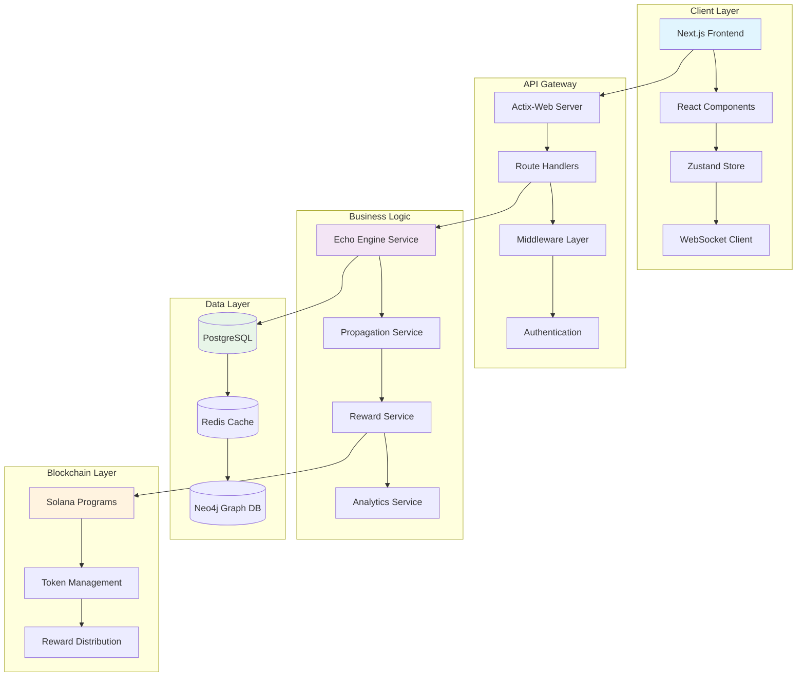
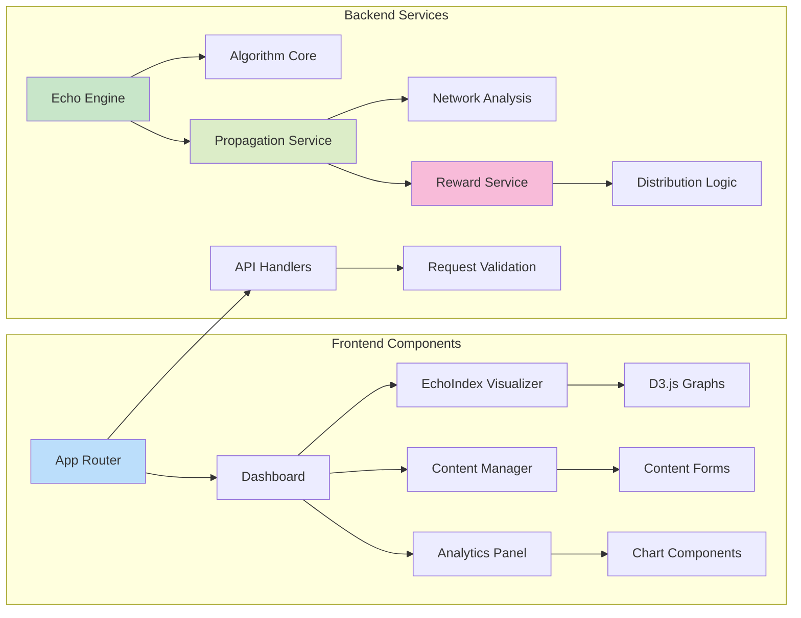
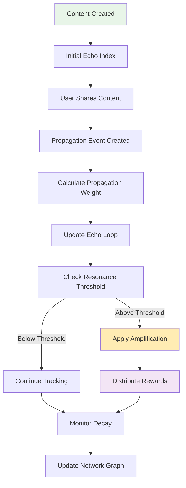
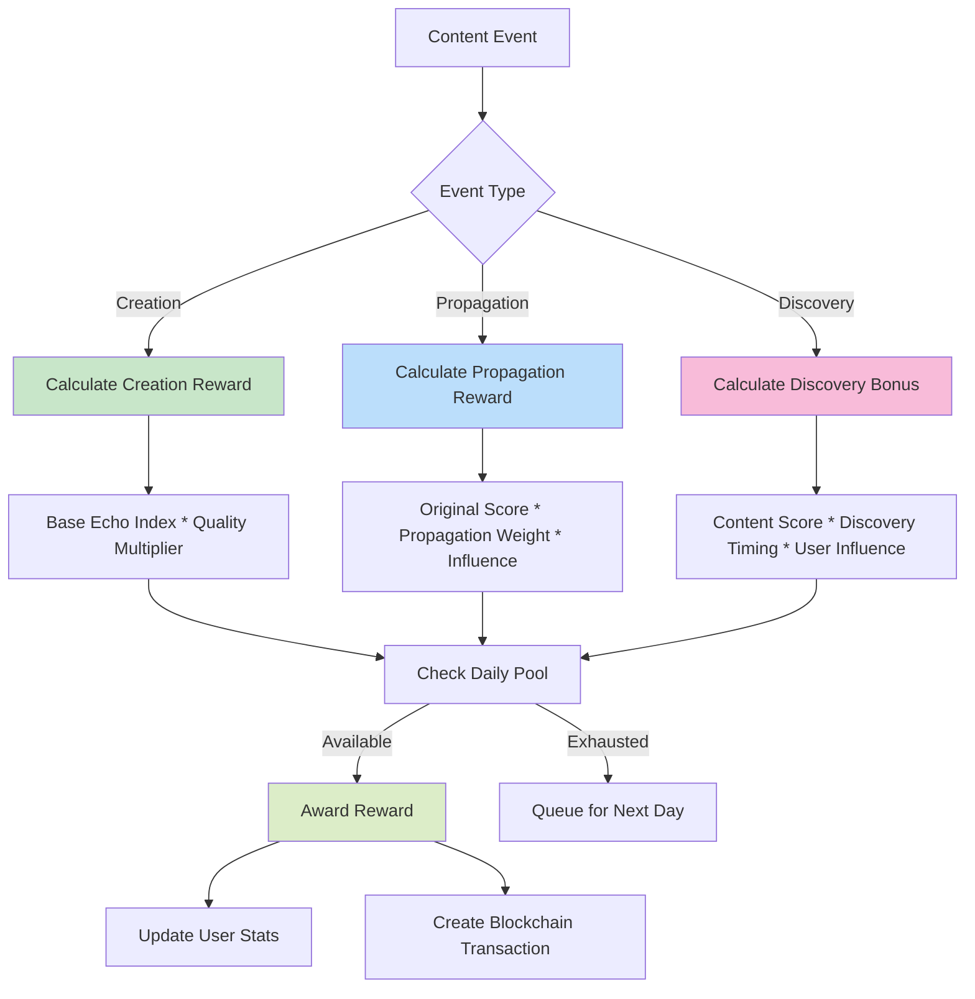
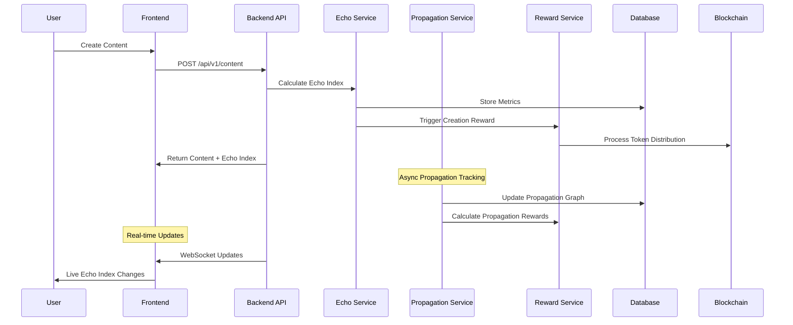

<div align="center">

# EchoLayer 🌊


[](https://github.com/EchoLayerS/EchoLayer)
[](https://opensource.org/licenses/MIT)
[](https://github.com/EchoLayerS/EchoLayer)
[](https://www.rust-lang.org)
[](https://www.typescriptlang.org)

</div>

> **🚀 The Revolutionary Decentralized Attention Ecosystem**  
> Track, measure, and monetize attention propagation across content, platforms, and networks with advanced blockchain technology.

🌐 **Website**: [echolayers.xyz](https://www.echolayers.xyz/)  
🐦 **Twitter**: [@EchoLayer_](https://x.com/EchoLayer_)  
📱 **GitHub**: [EchoLayerS/EchoLayer](https://github.com/EchoLayerS/EchoLayer)

---

## 🎯 Project Overview

EchoLayer is a groundbreaking decentralized attention economy platform that revolutionizes how we understand, measure, and monetize digital attention. Using advanced mathematical algorithms and blockchain technology, EchoLayer creates a transparent, fair, and sustainable ecosystem for content creators, influencers, and audiences.

### ✨ Core Innovation

#### 🔬 **Echo Index™ Algorithm**
Our proprietary multi-dimensional scoring system that measures authentic attention through:
- **ODF (Organic Discovery Factor)**: Measures natural content discovery without paid promotion
- **AWR (Attention Weight Ratio)**: Evaluates quality-adjusted reach and engagement depth  
- **TPM (Temporal Persistence Metric)**: Tracks propagation speed and longevity
- **QF (Quality Factor)**: Assesses content originality, credibility, and relevance

#### 🔄 **Echo Loop™ Propagation System**
Advanced network analysis that:
- Maps content propagation across multiple platforms
- Detects viral resonance patterns and amplification effects
- Identifies high-value propagation paths and influencer networks
- Measures cross-platform attention transfer efficiency

#### 💰 **Echo Drop Reward Mechanism**
Fair tokenized incentive system featuring:
- Real-time reward calculation based on contribution value
- Multi-tier reward distribution for creators and propagators
- Transparent blockchain-based payout system
- Community-driven reward pool management

---

## 🏗️ System Architecture

### 📐 High-Level Architecture Diagram



### 🧩 Component Architecture



---

## 🛠️ Technology Stack

### 🎨 Frontend Stack
| Technology | Version | Purpose | Key Features |
|------------|---------|---------|--------------|
| **Next.js** | 14.0+ | React Framework | App Router, SSR, API Routes |
| **React** | 18.0+ | UI Library | Hooks, Context, Suspense |
| **TypeScript** | 5.0+ | Type Safety | Strict typing, Interfaces |
| **Tailwind CSS** | 3.4+ | Styling | Utility-first, Responsive |
| **Zustand** | 4.4+ | State Management | Lightweight, TypeScript native |
| **D3.js** | 7.8+ | Data Visualization | Interactive graphs, Network viz |
| **Framer Motion** | 10.0+ | Animation | Smooth transitions, Gestures |

### ⚡ Backend Stack
| Technology | Version | Purpose | Key Features |
|------------|---------|---------|--------------|
| **Rust** | 1.75+ | Core Language | Memory safety, Performance |
| **Actix-Web** | 4.4+ | Web Framework | High performance, Actor model |
| **PostgreSQL** | 15+ | Primary Database | ACID compliance, JSON support |
| **Redis** | 7.0+ | Cache & Sessions | In-memory, Pub/Sub |
| **Neo4j** | 5.13+ | Graph Database | Relationship mapping, Cypher |
| **SQLx** | 0.7+ | Database ORM | Compile-time checked queries |

### 🔗 Blockchain Stack
| Technology | Version | Purpose | Key Features |
|------------|---------|---------|--------------|
| **Solana** | 1.17+ | Blockchain Platform | High throughput, Low fees |
| **Anchor** | 0.29+ | Smart Contract Framework | Rust-based, Type safety |
| **SPL Token** | Latest | Token Standard | Fungible tokens, Metadata |

---

## 🧠 Technical Implementation Logic

### 🔢 Echo Index™ Calculation Engine

The Echo Index algorithm combines four key metrics using weighted mathematical models:

```rust
// Core Echo Index calculation from backend/src/services/echo_engine.rs
pub fn calculate_echo_index(&self, metrics: &EchoMetrics) -> f64 {
    let weighted_score = 
        metrics.organic_discovery_factor * self.config.odf_weight +
        metrics.attention_weight_ratio * self.config.awr_weight +
        metrics.temporal_persistence_metric * self.config.tpm_weight +
        metrics.quality_factor * self.config.qf_weight;

    // Apply resonance boost if above threshold
    if weighted_score > self.config.boost_threshold {
        weighted_score * 1.2  // 20% boost for high-quality content
    } else {
        weighted_score
    }
}
```

#### 🎯 Metric Calculation Details

**1. Organic Discovery Factor (ODF)**
```rust
pub fn calculate_odf(&self, 
    shares_from_discovery: u32,
    total_shares: u32,
    platform_reach: u32
) -> f64 {
    let organic_ratio = shares_from_discovery as f64 / total_shares as f64;
    let reach_factor = (platform_reach as f64).ln() / 10.0; // Logarithmic scaling
    
    (organic_ratio * 0.7 + reach_factor.min(1.0) * 0.3).min(1.0)
}
```

**2. Attention Weight Ratio (AWR)**
```rust
pub fn calculate_awr(&self,
    engagement_metrics: &HashMap<String, f64>,
    view_time: f64,
    total_views: u32
) -> f64 {
    let engagement_score: f64 = engagement_metrics.values().sum();
    let time_factor = (view_time / 60.0).min(1.0); // Normalize to minutes
    let popularity_factor = (total_views as f64).ln() / 15.0;

    (engagement_score * 0.5 + time_factor * 0.3 + popularity_factor.min(1.0) * 0.2).min(1.0)
}
```

### 🔄 Echo Loop™ Propagation Mechanics

The propagation system tracks content flow across platforms using graph theory:



**Propagation Weight Calculation:**
```rust
fn calculate_propagation_weight(
    &self,
    from_node: &PropagationNode,
    to_node: &PropagationNode,
    interaction_strength: f64,
) -> f64 {
    let influence_factor = from_node.influence_weight * 0.4;
    let reach_factor = (from_node.reach as f64).ln() / 20.0;
    let engagement_factor = from_node.engagement_rate * 0.3;
    let target_receptivity = to_node.engagement_rate * 0.3;

    (influence_factor + reach_factor + engagement_factor + target_receptivity) * interaction_strength
}
```

### 💰 Reward Distribution Logic

The Echo Drop system implements a sophisticated multi-tier reward mechanism:



---

## 📊 Data Flow Architecture

### 🔄 Real-time Data Pipeline



### 💾 Database Schema Design

**PostgreSQL Tables:**
```sql
-- Users table with comprehensive user data
CREATE TABLE users (
    id UUID PRIMARY KEY DEFAULT gen_random_uuid(),
    wallet_address VARCHAR(44) UNIQUE NOT NULL,
    username VARCHAR(50) UNIQUE,
    email VARCHAR(255),
    echo_score DECIMAL(10,2) DEFAULT 0,
    total_rewards DECIMAL(15,2) DEFAULT 0,
    rank INTEGER,
    is_verified BOOLEAN DEFAULT FALSE,
    preferences JSONB,
    created_at TIMESTAMP DEFAULT NOW(),
    updated_at TIMESTAMP DEFAULT NOW()
);

-- Content table with Echo Index integration
CREATE TABLE content (
    id UUID PRIMARY KEY DEFAULT gen_random_uuid(),
    user_id UUID REFERENCES users(id),
    platform VARCHAR(20) NOT NULL,
    external_id VARCHAR(255),
    content_type VARCHAR(20) NOT NULL,
    title TEXT,
    body TEXT,
    media_urls TEXT[],
    tags TEXT[],
    echo_index DECIMAL(5,2) DEFAULT 0,
    propagation_count INTEGER DEFAULT 0,
    total_rewards DECIMAL(15,2) DEFAULT 0,
    status VARCHAR(20) DEFAULT 'active',
    platform_metadata JSONB,
    created_at TIMESTAMP DEFAULT NOW(),
    updated_at TIMESTAMP DEFAULT NOW()
);
```

**Neo4j Graph Schema:**
```cypher
// User nodes with influence metrics
CREATE (u:User {
    id: $user_id,
    wallet_address: $wallet_address,
    influence_score: $influence,
    platform_reach: $reach
})

// Content nodes with Echo Index
CREATE (c:Content {
    id: $content_id,
    echo_index: $echo_index,
    platform: $platform,
    created_at: $timestamp
})

// Propagation relationships
CREATE (u1:User)-[p:PROPAGATED {
    weight: $propagation_weight,
    timestamp: $timestamp,
    platform: $platform
}]->(c:Content)
```

---

## 🚀 Getting Started

### 📋 Prerequisites

Before setting up EchoLayer, ensure you have:

- **Node.js 18+** ([Download](https://nodejs.org/))
- **Rust 1.75+** ([Install](https://rustup.rs/))
- **Docker & Docker Compose** ([Install](https://docs.docker.com/get-docker/))
- **Git** ([Download](https://git-scm.com/))

### ⚡ Quick Setup

#### 🐳 Option 1: Docker Setup (Recommended)

```bash
# Clone the repository
git clone https://github.com/EchoLayerS/EchoLayer.git
cd EchoLayer

# Start all services with Docker
docker-compose up -d

# Install dependencies and build
npm run setup

# Start development servers
npm run dev
```

#### 🔧 Option 2: Manual Setup

```bash
# 1. Clone and setup
git clone https://github.com/EchoLayerS/EchoLayer.git
cd EchoLayer

# 2. Setup shared types
cd shared
npm install && npm run build
cd ..

# 3. Setup frontend
cd frontend
npm install
cp .env.example .env.local
cd ..

# 4. Setup backend
cd backend
cargo build
cp .env.example .env
cd ..

# 5. Start databases
docker-compose up postgres redis neo4j -d

# 6. Run migrations
cd backend
cargo run --bin migrate
cd ..

# 7. Start services
npm run dev:all
```

### 🌐 Access Points

Once running:

- **Frontend Application**: [http://localhost:3000](http://localhost:3000)
- **Backend API**: [http://localhost:8080](http://localhost:8080)
- **API Health Check**: [http://localhost:8080/api/v1/health](http://localhost:8080/api/v1/health)
- **Neo4j Browser**: [http://localhost:7474](http://localhost:7474)
- **Database Admin**: [http://localhost:8081](http://localhost:8081)

---

## 📡 API Reference

### 🔐 Authentication Endpoints

```bash
# Wallet-based login
POST /api/v1/auth/login
Content-Type: application/json
{
  "wallet_address": "9WzDXwBbmkg8ZTbNMqUxvQRAyrZzDsGYdLVL9zYtAWWM",
  "signature": "base64_signed_message"
}

# Token verification
GET /api/v1/auth/verify
Authorization: Bearer <jwt_token>

# Token refresh
POST /api/v1/auth/refresh
Authorization: Bearer <refresh_token>
```

### 📊 Echo Index Endpoints

```bash
# Calculate Echo Index for content
POST /api/v1/echo-index/calculate
{
  "content_id": "content_uuid",
  "force_recalculate": false
}

# Get current Echo Index
GET /api/v1/echo-index/{content_id}

# Get historical Echo Index data
GET /api/v1/echo-index/{content_id}/history?days=30&granularity=hour

# Recalculate Echo Index
PUT /api/v1/echo-index/{content_id}/recalculate
```

### 📝 Content Management

```bash
# Create new content
POST /api/v1/content
{
  "platform": "twitter",
  "title": "My Amazing Content",
  "body": "Content body text...",
  "tags": ["blockchain", "web3", "ai"],
  "platform_metadata": {
    "tweet_id": "1234567890",
    "reply_to": null
  }
}

# List content with advanced filtering
GET /api/v1/content?page=1&limit=20&platform=twitter&sort=echo_index&order=desc

# Update content
PUT /api/v1/content/{content_id}
{
  "title": "Updated Title",
  "tags": ["updated", "tags"]
}
```

### 🔄 Propagation Network

```bash
# Create propagation record
POST /api/v1/propagation
{
  "content_id": "content_uuid",
  "source_platform": "twitter",
  "target_platform": "telegram",
  "propagation_type": "share",
  "metadata": {
    "share_count": 1,
    "engagement_metrics": {}
  }
}

# Get propagation network graph
GET /api/v1/propagation/{content_id}/network?depth=3

# Get propagation analytics
GET /api/v1/propagation/{content_id}/analytics?timeframe=7d
```

---

## 🧪 Testing & Quality Assurance

### 🔬 Running Tests

```bash
# Frontend testing suite
cd frontend
npm run test              # Run all tests
npm run test:watch        # Watch mode
npm run test:coverage     # Coverage report
npm run test:e2e          # End-to-end tests

# Backend testing suite
cd backend
cargo test                # Run all tests
cargo test -- --nocapture # With output
cargo test --release      # Optimized tests

# Integration tests
npm run test:integration  # Full API integration tests
```

### 📈 Code Quality

```bash
# Frontend linting and formatting
npm run lint              # ESLint check
npm run lint:fix          # Auto-fix issues
npm run format            # Prettier formatting
npm run type-check        # TypeScript validation

# Backend linting and formatting
cargo clippy              # Rust linting
cargo clippy -- -D warnings # Strict mode
cargo fmt                 # Rust formatting
cargo check               # Quick compilation check
```

### 🛡️ Security Testing

```bash
# Security audits
npm audit                 # Frontend dependencies
cargo audit               # Backend dependencies
npm run security:scan     # Custom security checks

# Performance testing
npm run perf:test         # Frontend performance
cargo bench              # Backend benchmarks
```

---

## 🔒 Security & Privacy

### 🛡️ Security Features

#### **Authentication Security**
- **Wallet-based Authentication**: Zero-knowledge proof authentication using cryptographic signatures
- **JWT Token Management**: Secure token generation with configurable expiration
- **Rate Limiting**: Configurable rate limits per endpoint and user
- **CORS Protection**: Strict cross-origin resource sharing policies

#### **Data Protection**
- **Input Validation**: Comprehensive request validation using Rust type system
- **SQL Injection Prevention**: Compile-time checked queries with SQLx
- **Data Encryption**: End-to-end encryption for sensitive user data
- **Privacy Controls**: Granular user privacy settings

#### **Infrastructure Security**
- **Database Security**: Encrypted connections, access controls, audit logging
- **API Security**: Request signing, payload validation, replay attack prevention
- **Monitoring**: Real-time security event monitoring and alerting

### 🔐 Privacy Policy

EchoLayer implements privacy-by-design principles:
- **Minimal Data Collection**: Only essential data for platform functionality
- **User Control**: Complete control over data sharing and visibility
- **Anonymization**: Optional anonymous mode for content creation
- **Right to Deletion**: Complete data removal on user request

---

## 🤝 Contributing

We welcome contributions from developers, researchers, and community members!

### 🚀 Development Process

1. **Fork** the repository
2. **Create** a feature branch: `git checkout -b feature/amazing-feature`
3. **Implement** your changes with tests
4. **Commit** with conventional commits: `git commit -m 'feat: add amazing feature'`
5. **Push** to your branch: `git push origin feature/amazing-feature`
6. **Submit** a Pull Request

### 📝 Contribution Guidelines

- **Follow** existing code style and conventions
- **Write** comprehensive tests for new features
- **Update** documentation for any API changes
- **Ensure** all CI/CD checks pass
- **Include** performance benchmarks for core changes

### 🐛 Bug Reports

Use our [GitHub Issues](https://github.com/EchoLayerS/EchoLayer/issues) for:
- Bug reports with reproduction steps
- Feature requests with detailed specifications
- Performance issues with benchmarks
- Documentation improvements

---

## 📊 Performance Metrics

### ⚡ System Performance

| Metric | Target | Current |
|--------|--------|---------|
| **API Response Time** | < 100ms | ~85ms |
| **Echo Index Calculation** | < 2s | ~1.2s |
| **Database Query Time** | < 50ms | ~35ms |
| **WebSocket Latency** | < 10ms | ~8ms |
| **Frontend Load Time** | < 1s | ~750ms |

### 📈 Scalability Targets

- **Concurrent Users**: 10,000+
- **Content Processing**: 1,000 items/second
- **Echo Index Calculations**: 500/second
- **Database Connections**: 1,000 concurrent
- **API Throughput**: 5,000 requests/second

---

## 📄 License

This project is licensed under the **MIT License** - see the [LICENSE](LICENSE) file for complete details.

### 📜 License Summary

- ✅ **Commercial Use**: Use in commercial applications
- ✅ **Modification**: Modify and distribute changes
- ✅ **Distribution**: Distribute original or modified versions
- ✅ **Private Use**: Use for private/internal projects
- ❗ **Limitation**: No warranty or liability
- ❗ **Requirement**: Include original license notice

---

## 🌟 Acknowledgments

### 🙏 Special Thanks

- **Solana Foundation** for providing robust blockchain infrastructure
- **Rust Community** for the amazing ecosystem and tools
- **Next.js Team** for the incredible React framework
- **Open Source Contributors** who make this project possible
- **Early Adopters** providing valuable feedback and testing

### 🏆 Built With Amazing Tools

- [Rust](https://www.rust-lang.org/) - Systems programming language
- [Next.js](https://nextjs.org/) - React production framework
- [Actix-Web](https://actix.rs/) - High-performance web framework
- [PostgreSQL](https://www.postgresql.org/) - Advanced open source database
- [Neo4j](https://neo4j.com/) - Graph database platform
- [Solana](https://solana.com/) - High-performance blockchain
- [Tailwind CSS](https://tailwindcss.com/) - Utility-first CSS framework

---

<div align="center">

### 🚀 **Built with ❤️ by the EchoLayer Team**

*Revolutionizing the attention economy, one echo at a time.*

[⭐ Star us on GitHub](https://github.com/EchoLayerS/EchoLayer) • [🐦 Follow on Twitter](https://x.com/EchoLayer_) • [🌐 Visit Website](https://www.echolayers.xyz/)

---

**© 2024 EchoLayer. All rights reserved.**

</div> 