# 🏗️ EchoLayer Technical Architecture

> **Comprehensive Technical Architecture Documentation**  
> Deep dive into EchoLayer's system design, implementation patterns, and technical decisions.

---

## 📐 System Architecture Overview

### 🎯 Architecture Principles

EchoLayer follows a **microservices-inspired modular architecture** with clear separation of concerns:

- **🔒 Security First**: Zero-trust security model with wallet-based authentication
- **📈 Scalability**: Horizontal scaling capabilities with stateless services  
- **⚡ Performance**: High-throughput design with Redis caching and connection pooling
- **🔄 Real-time**: WebSocket-based real-time updates and event streaming
- **🧩 Modularity**: Loosely coupled services with well-defined interfaces
- **🛡️ Resilience**: Circuit breakers, retry logic, and graceful degradation

### 🌐 High-Level System Diagram


---

## 🏛️ Service Architecture

### 🔧 Backend Services Detail


### 📊 Service Responsibilities

| Service | Primary Function | Key Components | Data Sources |
|---------|------------------|----------------|--------------|
| **Echo Engine** | Calculate Echo Index scores | ODF, AWR, TPM, QF calculators | PostgreSQL, Redis |
| **Propagation** | Track content spread | Network graph, Path analysis | Neo4j, PostgreSQL |
| **Reward System** | Distribute tokens | Pool management, Payouts | PostgreSQL, Solana |
| **Analytics** | Generate insights | Metrics aggregation, Reports | All databases |
| **Notification** | Real-time updates | WebSocket management | Redis Pub/Sub |

---

## 🧠 Echo Index™ Algorithm Architecture

### 🔢 Mathematical Model

The Echo Index combines four weighted metrics using a sophisticated scoring algorithm:

```rust
// Core mathematical model
EchoIndex = (ODF × W₁) + (AWR × W₂) + (TPM × W₃) + (QF × W₄)

Where:
- ODF: Organic Discovery Factor (0.0 - 1.0)
- AWR: Attention Weight Ratio (0.0 - 1.0) 
- TPM: Temporal Persistence Metric (0.0 - 1.0)
- QF: Quality Factor (0.0 - 1.0)
- W₁, W₂, W₃, W₄: Configurable weights (default: 0.3, 0.25, 0.25, 0.2)
```

### 🎯 Algorithm Flow Diagram


### 📈 Metric Calculation Details

#### 1️⃣ Organic Discovery Factor (ODF)

```rust
pub fn calculate_odf(&self, 
    shares_from_discovery: u32,
    total_shares: u32,
    platform_reach: u32
) -> f64 {
    if total_shares == 0 { return 0.0; }
    
    // Organic ratio: higher = more authentic discovery
    let organic_ratio = shares_from_discovery as f64 / total_shares as f64;
    
    // Logarithmic platform reach scaling
    let reach_factor = (platform_reach as f64).ln() / 10.0;
    
    // Weighted combination with 70% organic, 30% reach
    (organic_ratio * 0.7 + reach_factor.min(1.0) * 0.3).min(1.0)
}
```

**ODF Factors:**
- **Organic Shares**: Content shared without paid promotion
- **Total Shares**: All content sharing activities
- **Platform Reach**: Natural audience size on platform
- **Authenticity Score**: Detection of bot vs. human interaction

#### 2️⃣ Attention Weight Ratio (AWR)

```rust
pub fn calculate_awr(&self,
    engagement_metrics: &HashMap<String, f64>,
    view_time: f64,
    total_views: u32
) -> f64 {
    // Sum all engagement types (likes, comments, shares, etc.)
    let engagement_score: f64 = engagement_metrics.values().sum();
    
    // Normalize view time to minutes (higher retention = better)
    let time_factor = (view_time / 60.0).min(1.0);
    
    // Logarithmic popularity scaling to prevent viral bias
    let popularity_factor = (total_views as f64).ln() / 15.0;
    
    // Weighted combination: 50% engagement, 30% time, 20% popularity
    (engagement_score * 0.5 + time_factor * 0.3 + popularity_factor.min(1.0) * 0.2).min(1.0)
}
```

**AWR Components:**
- **Engagement Depth**: Quality of user interactions (comments > likes > views)
- **Dwell Time**: Average time users spend with content
- **Interaction Quality**: Meaningful vs. superficial engagement
- **Audience Retention**: How long content holds attention

#### 3️⃣ Temporal Persistence Metric (TPM)

```rust
pub fn calculate_tpm(&self,
    creation_time: i64,
    last_interaction: i64,
    interaction_frequency: f64
) -> f64 {
    let current_time = chrono::Utc::now().timestamp();
    
    // Content age in days
    let content_age = (current_time - creation_time) as f64 / 86400.0;
    
    // Recency of last interaction
    let recency = (current_time - last_interaction) as f64 / 86400.0;
    
    // Age decay factor (older content scores lower)
    let age_factor = (1.0 / (1.0 + content_age * 0.1)).max(0.1);
    
    // Recency factor (recent interaction = better)
    let recency_factor = (1.0 / (1.0 + recency * 0.2)).max(0.1);
    
    // Interaction frequency normalization
    let frequency_factor = (interaction_frequency / 10.0).min(1.0);
    
    // Weighted combination: 30% age, 40% recency, 30% frequency
    (age_factor * 0.3 + recency_factor * 0.4 + frequency_factor * 0.3).min(1.0)
}
```

**TPM Elements:**
- **Propagation Velocity**: Speed of initial content spread
- **Sustained Interest**: Long-term engagement patterns  
- **Interaction Frequency**: Regular vs. one-time interactions
- **Temporal Distribution**: Even spread vs. concentrated bursts

#### 4️⃣ Quality Factor (QF)

```rust
pub fn calculate_qf(&self,
    sentiment_score: f64,      // [-1.0, 1.0]
    credibility_score: f64,    // [0.0, 1.0]
    relevance_score: f64,      // [0.0, 1.0]
    originality_score: f64     // [0.0, 1.0]
) -> f64 {
    // Normalize sentiment from [-1,1] to [0,1]
    let normalized_sentiment = (sentiment_score + 1.0) / 2.0;
    
    // Ensure all scores are in valid range
    let credibility = credibility_score.max(0.0).min(1.0);
    let relevance = relevance_score.max(0.0).min(1.0);
    let originality = originality_score.max(0.0).min(1.0);
    
    // Weighted quality assessment
    (normalized_sentiment * 0.2 +   // 20% sentiment positivity
     credibility * 0.3 +            // 30% source credibility
     relevance * 0.3 +              // 30% topic relevance
     originality * 0.2).min(1.0)    // 20% content originality
}
```

**QF Metrics:**
- **Sentiment Analysis**: Positive vs. negative content reception
- **Source Credibility**: Author reputation and verification status
- **Content Relevance**: Alignment with trending topics and user interests
- **Originality**: Uniqueness vs. copied/repeated content

---

## 🔄 Echo Loop™ Propagation System

### 🌊 Propagation Flow Architecture


### 📈 Network Graph Structure

**Neo4j Graph Schema:**

```cypher
// User nodes with influence metrics
CREATE (u:User {
    id: $user_id,
    wallet_address: $wallet_address,
    influence_score: $influence,
    platform_reach: $reach,
    engagement_rate: $engagement,
    created_at: $timestamp
})

// Content nodes with Echo Index data
CREATE (c:Content {
    id: $content_id,
    echo_index: $echo_index,
    platform: $platform,
    content_type: $type,
    created_at: $timestamp,
    last_updated: $updated
})

// Platform nodes for cross-platform tracking
CREATE (p:Platform {
    name: $platform_name,
    api_version: $version,
    active_users: $user_count
})

// Propagation relationships with detailed metadata
CREATE (u1:User)-[prop:PROPAGATED {
    weight: $propagation_weight,
    timestamp: $timestamp,
    platform: $platform,
    interaction_type: $type,
    engagement_metrics: $metrics,
    boost_applied: $boost
}]->(c:Content)

// Cross-platform propagation
CREATE (c:Content)-[cross:CROSS_PLATFORM {
    source_platform: $source,
    target_platform: $target,
    transfer_weight: $weight,
    loss_factor: $loss
}]->(c2:Content)
```

### 🎯 Propagation Weight Calculation

```rust
fn calculate_propagation_weight(
    &self,
    from_node: &PropagationNode,
    to_node: &PropagationNode,
    interaction_strength: f64,
) -> f64 {
    // User influence contribution (40%)
    let influence_factor = from_node.influence_weight * 0.4;
    
    // Platform reach with logarithmic scaling (20%)
    let reach_factor = (from_node.reach as f64).ln() / 20.0;
    
    // Source engagement rate (30%)
    let engagement_factor = from_node.engagement_rate * 0.3;
    
    // Target receptivity (user's likelihood to engage) (30%)
    let target_receptivity = to_node.engagement_rate * 0.3;
    
    // Combined with interaction strength multiplier
    (influence_factor + reach_factor + engagement_factor + target_receptivity) * interaction_strength
}
```

---

## 💰 Reward Distribution Architecture

### 🏆 Multi-Tier Reward System

```mermaid
graph TD
    A[Content Event] --> B{Event Classification}
    
    B -->|Creation| C[Content Creation Reward]
    B -->|Propagation| D[Propagation Reward]
    B -->|Discovery| E[Discovery Bonus]
    B -->|Quality| F[Quality Achievement]
    B -->|Milestone| G[Milestone Reward]
    
    C --> H[Base Echo Index × Quality Multiplier]
    D --> I[Original Score × Propagation Weight × User Influence]
    E --> J[Content Score × Discovery Timing × Finder Influence]
    F --> K[Performance Threshold × Viral Coefficient]
    G --> L[Fixed Amount × Achievement Level]
    
    H --> M[Daily Pool Check]
    I --> M
    J --> M
    K --> M
    L --> M
    
    M -->|Pool Available| N[Process Reward]
    M -->|Pool Exhausted| O[Queue for Next Day]
    
    N --> P[Update User Stats]
    N --> Q[Create Blockchain Transaction]
    N --> R[Send Notification]
    
    style C fill:#c8e6c9
    style D fill:#bbdefb
    style E fill:#f8bbd9
    style F fill:#ffecb3
    style N fill:#dcedc8
```



### 💎 Reward Types & Calculations

#### 🎨 Content Creation Rewards

```rust
pub fn calculate_content_creation_reward(
    &self,
    echo_index: f64,
    content_quality_score: f64,
    initial_engagement: f64,
) -> f64 {
    // Base reward proportional to Echo Index
    let base_reward = echo_index * self.multipliers.base_rate;
    
    // Quality bonus for high-scoring content (threshold: 0.7)
    let quality_bonus = if content_quality_score > 0.7 {
        base_reward * (self.multipliers.quality_multiplier - 1.0)
    } else {
        0.0
    };
    
    // Early engagement factor (up to 50% bonus)
    let engagement_factor = (initial_engagement * 0.1).min(0.5);
    
    (base_reward + quality_bonus) * (1.0 + engagement_factor)
}
```

#### 🔄 Propagation Rewards

```rust
pub fn calculate_propagation_reward(
    &self,
    original_echo_index: f64,
    propagation_weight: f64,
    user_influence: f64,
    loop_strength: f64,
) -> f64 {
    // Base propagation reward (10% of original content value)
    let base_propagation_reward = original_echo_index * propagation_weight * 0.1;
    
    // User influence bonus (up to 5% additional)
    let influence_bonus = user_influence * 0.05;
    
    // Echo Loop resonance bonus (threshold: 0.5)
    let loop_bonus = if loop_strength > 0.5 {
        base_propagation_reward * (self.multipliers.propagation_multiplier - 1.0)
    } else {
        0.0
    };

    base_propagation_reward + influence_bonus + loop_bonus
}
```

#### 🔍 Discovery Bonuses

```rust
pub fn calculate_discovery_bonus(
    &self,
    discovered_content_echo_index: f64,
    discovery_timing: f64,        // 0.0 = late, 1.0 = very early
    discoverer_influence: f64,
) -> f64 {
    // Early discovery bonus (earlier = higher)
    let timing_bonus = (1.0 - discovery_timing).max(0.0);
    
    // Base discovery reward (5% of content value)
    let base_discovery_reward = discovered_content_echo_index * 0.05;
    
    // Discoverer influence factor (up to 30% bonus)
    let influence_factor = (discoverer_influence * 0.1).min(0.3);

    base_discovery_reward * (1.0 + timing_bonus + influence_factor)
}
```

### 📊 Pool Management System

```rust
pub struct RewardPoolManager {
    daily_pool: f64,
    current_remaining: f64,
    allocated_pools: HashMap<RewardType, f64>,
    reserve_percentage: f64,
    auto_refill_enabled: bool,
}

impl RewardPoolManager {
    // Pool allocation percentages
    const CONTENT_CREATION_POOL: f64 = 0.40;  // 40%
    const PROPAGATION_POOL: f64 = 0.30;       // 30%
    const DISCOVERY_POOL: f64 = 0.15;         // 15%
    const QUALITY_BONUS_POOL: f64 = 0.10;     // 10%
    const RESERVE_POOL: f64 = 0.05;           // 5%
    
    pub fn allocate_daily_pool(&mut self) {
        self.allocated_pools.insert(
            RewardType::ContentCreation,
            self.daily_pool * Self::CONTENT_CREATION_POOL
        );
        // ... additional allocations
    }
}
```

---

## 💾 Database Architecture

### 🗄️ Multi-Database Strategy

EchoLayer employs a **polyglot persistence** approach with specialized databases:

#### 📊 PostgreSQL - Primary Data Store

```sql
-- Optimized table structure with indexing strategy

-- Users table with comprehensive indexing
CREATE TABLE users (
    id UUID PRIMARY KEY DEFAULT gen_random_uuid(),
    wallet_address VARCHAR(44) UNIQUE NOT NULL,
    username VARCHAR(50) UNIQUE,
    email VARCHAR(255),
    echo_score DECIMAL(10,2) DEFAULT 0,
    total_rewards DECIMAL(15,2) DEFAULT 0,
    rank INTEGER,
    influence_score DECIMAL(5,2) DEFAULT 0,
    is_verified BOOLEAN DEFAULT FALSE,
    preferences JSONB,
    created_at TIMESTAMP DEFAULT NOW(),
    updated_at TIMESTAMP DEFAULT NOW()
);

-- Performance indexes
CREATE INDEX idx_users_wallet_address ON users(wallet_address);
CREATE INDEX idx_users_echo_score ON users(echo_score DESC);
CREATE INDEX idx_users_rank ON users(rank ASC) WHERE rank IS NOT NULL;
CREATE INDEX idx_users_created_at ON users(created_at);

-- Content table with Echo Index optimization
CREATE TABLE content (
    id UUID PRIMARY KEY DEFAULT gen_random_uuid(),
    user_id UUID REFERENCES users(id) ON DELETE CASCADE,
    platform VARCHAR(20) NOT NULL,
    external_id VARCHAR(255),
    content_type VARCHAR(20) NOT NULL,
    title TEXT,
    body TEXT,
    media_urls TEXT[],
    tags TEXT[],
    echo_index DECIMAL(5,2) DEFAULT 0,
    odf_score DECIMAL(5,2) DEFAULT 0,
    awr_score DECIMAL(5,2) DEFAULT 0,
    tpm_score DECIMAL(5,2) DEFAULT 0,
    qf_score DECIMAL(5,2) DEFAULT 0,
    propagation_count INTEGER DEFAULT 0,
    total_rewards DECIMAL(15,2) DEFAULT 0,
    status VARCHAR(20) DEFAULT 'active',
    platform_metadata JSONB,
    created_at TIMESTAMP DEFAULT NOW(),
    updated_at TIMESTAMP DEFAULT NOW()
);

-- Content performance indexes
CREATE INDEX idx_content_echo_index ON content(echo_index DESC);
CREATE INDEX idx_content_user_platform ON content(user_id, platform);
CREATE INDEX idx_content_status_created ON content(status, created_at DESC);
CREATE INDEX idx_content_tags ON content USING GIN(tags);
CREATE INDEX idx_content_platform_metadata ON content USING GIN(platform_metadata);

-- Echo Index history for temporal analysis
CREATE TABLE echo_index_history (
    id UUID PRIMARY KEY DEFAULT gen_random_uuid(),
    content_id UUID REFERENCES content(id) ON DELETE CASCADE,
    echo_index DECIMAL(5,2) NOT NULL,
    odf_score DECIMAL(5,2) NOT NULL,
    awr_score DECIMAL(5,2) NOT NULL,
    tpm_score DECIMAL(5,2) NOT NULL,
    qf_score DECIMAL(5,2) NOT NULL,
    calculation_metadata JSONB,
    calculated_at TIMESTAMP DEFAULT NOW()
);

-- Time-series index for trend analysis
CREATE INDEX idx_echo_history_content_time ON echo_index_history(content_id, calculated_at DESC);
```

#### ⚡ Redis - Caching & Real-time

```redis
# Cache key patterns and TTL strategies

# User session cache (24 hour TTL)
SET user:session:{user_id} "{jwt_token_data}" EX 86400

# Echo Index calculation cache (1 hour TTL)
SET echo:calc:{content_id} "{echo_metrics_json}" EX 3600

# Leaderboard cache (10 minute TTL)
ZADD leaderboard:echo_score {score} {user_id}
EXPIRE leaderboard:echo_score 600

# Real-time propagation events
LPUSH propagation:events:{content_id} "{event_data}"
EXPIRE propagation:events:{content_id} 3600

# Rate limiting
INCR rate_limit:{user_id}:{endpoint}
EXPIRE rate_limit:{user_id}:{endpoint} 60

# WebSocket connection tracking
SADD connected_users {user_id}
SET user:ws:{user_id} "{connection_id}" EX 3600
```

#### 🕸️ Neo4j - Graph Relationships

```cypher
// Optimized graph schema with constraints

// Create constraints for performance
CREATE CONSTRAINT user_id IF NOT EXISTS FOR (u:User) REQUIRE u.id IS UNIQUE;
CREATE CONSTRAINT content_id IF NOT EXISTS FOR (c:Content) REQUIRE c.id IS UNIQUE;
CREATE CONSTRAINT platform_name IF NOT EXISTS FOR (p:Platform) REQUIRE p.name IS UNIQUE;

// Create indexes for common queries
CREATE INDEX user_influence IF NOT EXISTS FOR (u:User) ON (u.influence_score);
CREATE INDEX content_echo IF NOT EXISTS FOR (c:Content) ON (c.echo_index);
CREATE INDEX propagation_weight IF NOT EXISTS FOR ()-[r:PROPAGATED]-() ON (r.weight);

// Complex propagation queries
MATCH (u1:User)-[p:PROPAGATED]->(c:Content)<-[p2:PROPAGATED]-(u2:User)
WHERE c.id = $content_id 
  AND p.timestamp >= datetime() - duration('P7D')
RETURN u1, u2, p, p2, c
ORDER BY p.weight DESC
LIMIT 100;

// Network influence calculation
MATCH (u:User)-[p:PROPAGATED]->(c:Content)
WHERE u.id = $user_id
WITH u, COUNT(p) as propagation_count, AVG(p.weight) as avg_weight
SET u.influence_score = propagation_count * avg_weight * 0.1
RETURN u.influence_score;
```

---

## 🔐 Security Architecture

### 🛡️ Security Layers


### 🔒 Authentication Flow

```rust
// JWT-based authentication with wallet signatures
pub struct AuthService {
    jwt_secret: String,
    token_expiry: Duration,
}

impl AuthService {
    // Wallet signature verification
    pub async fn verify_wallet_signature(
        &self,
        wallet_address: &str,
        message: &str,
        signature: &str,
    ) -> Result<bool, AuthError> {
        // Verify Solana wallet signature
        let public_key = Pubkey::from_str(wallet_address)?;
        let signature = Signature::from_str(signature)?;
        let message_bytes = message.as_bytes();
        
        // Cryptographic verification
        signature.verify(&public_key.to_bytes(), message_bytes)
            .map_err(|_| AuthError::InvalidSignature)
    }
    
    // Generate JWT token
    pub fn generate_token(&self, user_id: &str) -> Result<String, AuthError> {
        let claims = Claims {
            sub: user_id.to_string(),
            exp: (Utc::now() + self.token_expiry).timestamp(),
            iat: Utc::now().timestamp(),
        };
        
        encode(
            &Header::default(),
            &claims,
            &EncodingKey::from_secret(self.jwt_secret.as_ref()),
        ).map_err(|_| AuthError::TokenGeneration)
    }
}
```

### 🚫 Rate Limiting Strategy

```rust
// Multi-tier rate limiting
pub struct RateLimiter {
    redis_client: redis::Client,
}

impl RateLimiter {
    // Tier-based limits
    const LIMITS: &'static [(&'static str, u32, u32)] = &[
        ("api:public", 100, 60),      // 100 requests per minute
        ("api:authenticated", 1000, 60), // 1000 requests per minute  
        ("echo:calculate", 10, 60),    // 10 calculations per minute
        ("content:create", 5, 60),     // 5 content posts per minute
    ];
    
    pub async fn check_rate_limit(
        &self,
        user_id: &str,
        endpoint: &str,
    ) -> Result<bool, RateLimitError> {
        let key = format!("rate:{}:{}:{}", user_id, endpoint, get_current_minute());
        let mut conn = self.redis_client.get_async_connection().await?;
        
        let current: u32 = conn.incr(&key, 1).await?;
        if current == 1 {
            conn.expire(&key, 60).await?; // Set TTL
        }
        
        let limit = self.get_limit_for_endpoint(endpoint);
        Ok(current <= limit)
    }
}
```

---

## 📈 Performance & Scalability

### ⚡ Performance Optimization Strategies

#### 🔄 Database Optimization

```rust
// Connection pooling with SQLx
pub struct DatabasePool {
    postgres_pool: PgPool,
    redis_pool: r2d2::Pool<RedisConnectionManager>,
}

impl DatabasePool {
    pub async fn new() -> Result<Self, DatabaseError> {
        // PostgreSQL pool with optimized settings
        let postgres_pool = PgPoolOptions::new()
            .max_connections(100)
            .min_connections(10)
            .acquire_timeout(Duration::from_secs(5))
            .idle_timeout(Duration::from_secs(300))
            .max_lifetime(Duration::from_secs(1800))
            .connect(&DATABASE_URL).await?;
            
        // Redis pool for caching
        let redis_manager = RedisConnectionManager::new(REDIS_URL)?;
        let redis_pool = r2d2::Pool::builder()
            .max_size(50)
            .min_idle(Some(5))
            .connection_timeout(Duration::from_secs(2))
            .build(redis_manager)?;
            
        Ok(Self { postgres_pool, redis_pool })
    }
}
```

#### 📊 Query Optimization

```sql
-- Optimized queries with proper indexing

-- Echo Index leaderboard with pagination
SELECT 
    u.id,
    u.username,
    u.wallet_address,
    u.echo_score,
    u.rank,
    COUNT(c.id) as content_count
FROM users u
LEFT JOIN content c ON u.id = c.user_id 
    AND c.status = 'active'
    AND c.created_at >= NOW() - INTERVAL '30 days'
WHERE u.echo_score > 0
GROUP BY u.id, u.username, u.wallet_address, u.echo_score, u.rank
ORDER BY u.echo_score DESC
LIMIT 50 OFFSET $1;

-- Content propagation analysis
WITH propagation_stats AS (
    SELECT 
        c.id,
        c.echo_index,
        COUNT(p.id) as propagation_count,
        AVG(p.echo_boost) as avg_boost,
        MAX(p.created_at) as last_propagation
    FROM content c
    LEFT JOIN propagation p ON c.id = p.content_id
    WHERE c.created_at >= NOW() - INTERVAL '7 days'
    GROUP BY c.id, c.echo_index
)
SELECT * FROM propagation_stats
WHERE propagation_count > 5
ORDER BY echo_index DESC;
```

### 📈 Scalability Targets

| Component | Current Capacity | Target Capacity | Scaling Strategy |
|-----------|------------------|-----------------|------------------|
| **API Throughput** | 1,000 RPS | 10,000 RPS | Horizontal scaling, Load balancing |
| **Database Connections** | 100 concurrent | 1,000 concurrent | Connection pooling, Read replicas |
| **Echo Calculations** | 100/sec | 1,000/sec | Async processing, Queue system |
| **WebSocket Connections** | 1,000 concurrent | 10,000 concurrent | Multiple server instances |
| **Graph Queries** | 50/sec | 500/sec | Neo4j clustering, Query optimization |

---

## 🔄 Data Flow & Event Processing

### 📡 Event-Driven Architecture


### ⚡ Real-time Processing Pipeline

```rust
// Event processing system
pub struct EventProcessor {
    event_bus: Arc<Mutex<Vec<Event>>>,
    subscribers: HashMap<EventType, Vec<Box<dyn EventHandler>>>,
}

impl EventProcessor {
    // Async event processing
    pub async fn process_event(&self, event: Event) -> Result<(), ProcessingError> {
        // Add to event stream
        self.event_bus.lock().unwrap().push(event.clone());
        
        // Notify subscribers
        if let Some(handlers) = self.subscribers.get(&event.event_type) {
            for handler in handlers {
                tokio::spawn(async move {
                    handler.handle(event.clone()).await;
                });
            }
        }
        
        Ok(())
    }
    
    // Real-time WebSocket broadcasting
    pub async fn broadcast_update(&self, update: RealtimeUpdate) {
        let message = serde_json::to_string(&update).unwrap();
        
        // Broadcast to connected clients
        for connection in self.websocket_connections.iter() {
            if let Err(e) = connection.send(message.clone()).await {
                log::warn!("Failed to send WebSocket message: {}", e);
            }
        }
    }
}
```

---

## 🧪 Testing Architecture

### 🔬 Testing Strategy

```rust
// Comprehensive testing approach

#[cfg(test)]
mod tests {
    use super::*;
    
    // Unit tests for Echo Index calculation
    #[tokio::test]
    async fn test_echo_index_calculation() {
        let echo_engine = EchoEngine::default();
        let metrics = EchoMetrics {
            organic_discovery_factor: 0.8,
            attention_weight_ratio: 0.7,
            temporal_persistence_metric: 0.6,
            quality_factor: 0.9,
        };
        
        let result = echo_engine.calculate_echo_index(&metrics);
        assert!(result > 0.0 && result <= 1.0);
    }
    
    // Integration tests with database
    #[tokio::test]
    async fn test_content_creation_flow() {
        let test_db = setup_test_database().await;
        let app = create_test_app(test_db).await;
        
        let response = app
            .oneshot(Request::builder()
                .method("POST")
                .uri("/api/v1/content")
                .header("content-type", "application/json")
                .body(Body::from(r#"{"title":"Test","body":"Content"}"#))
                .unwrap())
            .await
            .unwrap();
            
        assert_eq!(response.status(), StatusCode::CREATED);
    }
    
    // Performance benchmarks
    #[tokio::test]
    async fn benchmark_echo_calculation() {
        let echo_engine = EchoEngine::default();
        let start = Instant::now();
        
        for _ in 0..1000 {
            echo_engine.calculate_complete_echo_index(/* params */);
        }
        
        let duration = start.elapsed();
        assert!(duration < Duration::from_millis(1000)); // < 1ms per calculation
    }
}
```

---

## 📊 Monitoring & Observability

### 📈 Metrics Collection

```rust
// Prometheus metrics integration
use prometheus::{Counter, Histogram, Gauge};

lazy_static! {
    static ref ECHO_CALCULATIONS: Counter = Counter::new(
        "echo_calculations_total", 
        "Total number of Echo Index calculations"
    ).unwrap();
    
    static ref API_REQUEST_DURATION: Histogram = Histogram::with_opts(
        prometheus::HistogramOpts::new(
            "api_request_duration_seconds",
            "API request duration in seconds"
        )
    ).unwrap();
    
    static ref ACTIVE_USERS: Gauge = Gauge::new(
        "active_users_total",
        "Number of currently active users"
    ).unwrap();
}

// Metrics middleware
pub async fn metrics_middleware(
    req: Request<Body>,
    next: Next<Body>,
) -> Result<Response<Body>, Infallible> {
    let start = Instant::now();
    let response = next.run(req).await;
    let duration = start.elapsed().as_secs_f64();
    
    API_REQUEST_DURATION.observe(duration);
    
    Ok(response)
}
```

---

## 🎯 Deployment Architecture

### 🐳 Container Strategy

```yaml
# docker-compose.production.yml
version: '3.8'

services:
  app:
    build: .
    ports:
      - "8080:8080"
    environment:
      - RUST_LOG=info
      - DATABASE_URL=${DATABASE_URL}
    depends_on:
      - postgres
      - redis
      - neo4j
    deploy:
      replicas: 3
      resources:
        limits:
          memory: 1G
          cpus: '0.5'
        
  postgres:
    image: postgres:15-alpine
    environment:
      POSTGRES_DB: echolayer
      POSTGRES_USER: ${DB_USER}
      POSTGRES_PASSWORD: ${DB_PASSWORD}
    volumes:
      - postgres_data:/var/lib/postgresql/data
    deploy:
      resources:
        limits:
          memory: 2G
          
  redis:
    image: redis:7-alpine
    volumes:
      - redis_data:/data
    deploy:
      resources:
        limits:
          memory: 512M
          
  neo4j:
    image: neo4j:5.13-community
    environment:
      NEO4J_AUTH: neo4j/${NEO4J_PASSWORD}
    volumes:
      - neo4j_data:/data
    deploy:
      resources:
        limits:
          memory: 2G

volumes:
  postgres_data:
  redis_data:
  neo4j_data:
```

### ☸️ Kubernetes Deployment

```yaml
# k8s/deployment.yml
apiVersion: apps/v1
kind: Deployment
metadata:
  name: echolayer-api
spec:
  replicas: 3
  selector:
    matchLabels:
      app: echolayer-api
  template:
    metadata:
      labels:
        app: echolayer-api
    spec:
      containers:
      - name: api
        image: echolayer/api:latest
        ports:
        - containerPort: 8080
        env:
        - name: DATABASE_URL
          valueFrom:
            secretKeyRef:
              name: db-secret
              key: url
        resources:
          requests:
            memory: "512Mi"
            cpu: "250m"
          limits:
            memory: "1Gi"
            cpu: "500m"
        livenessProbe:
          httpGet:
            path: /api/v1/health
            port: 8080
          initialDelaySeconds: 30
          periodSeconds: 10
        readinessProbe:
          httpGet:
            path: /api/v1/ready
            port: 8080
          initialDelaySeconds: 5
          periodSeconds: 5
```

---

## 📚 Additional Resources

### 🔗 Related Documentation

- **[API Documentation](./API_DOCUMENTATION.md)** - Complete API reference
- **[Environment Setup](./ENVIRONMENT_SETUP.md)** - Development environment guide
- **[Deployment Guide](./DEPLOYMENT.md)** - Production deployment instructions
- **[Contributing Guide](../CONTRIBUTING.md)** - Contribution guidelines

### 🛠️ Development Tools

- **[Rust Analyzer](https://rust-analyzer.github.io/)** - IDE support for Rust
- **[pgAdmin](https://www.pgadmin.org/)** - PostgreSQL administration
- **[Neo4j Browser](https://neo4j.com/developer/neo4j-browser/)** - Graph database exploration
- **[Redis Commander](https://github.com/joeferner/redis-commander)** - Redis management

---

<div align="center">

**🏗️ Technical Architecture maintained by the EchoLayer Engineering Team**

*Building the future of decentralized attention economies*

</div> 